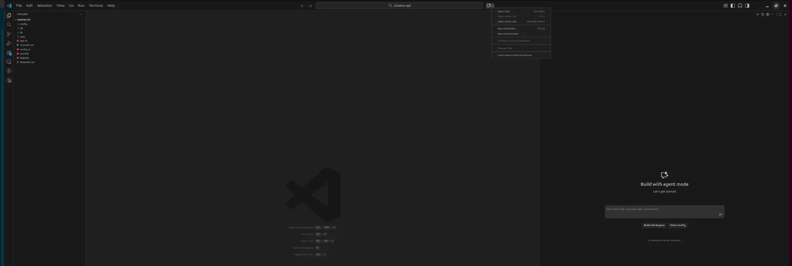
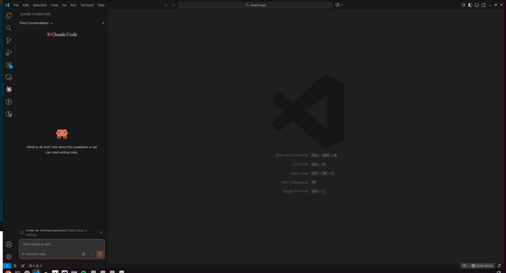
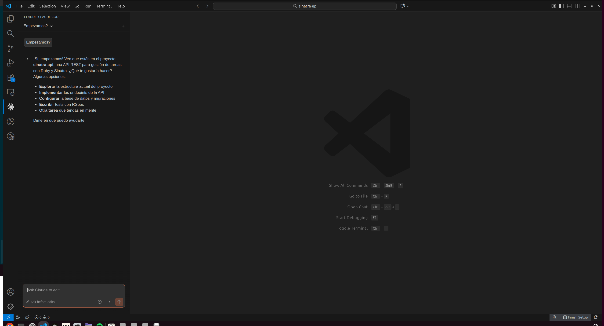
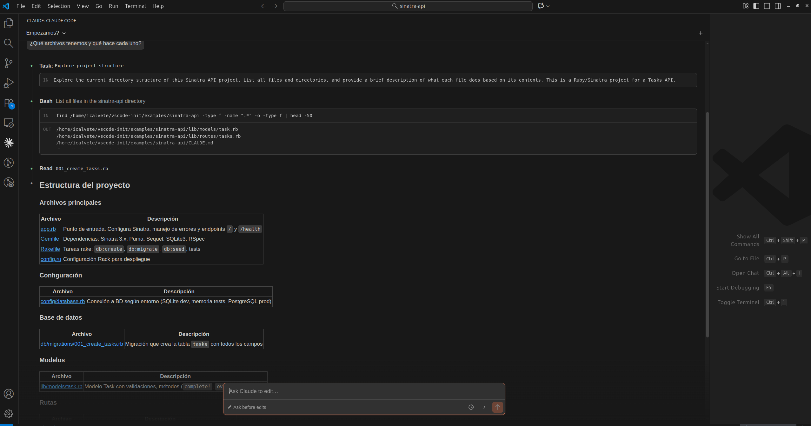
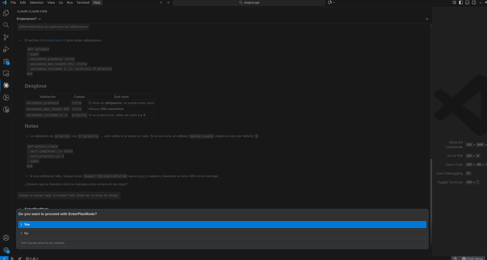
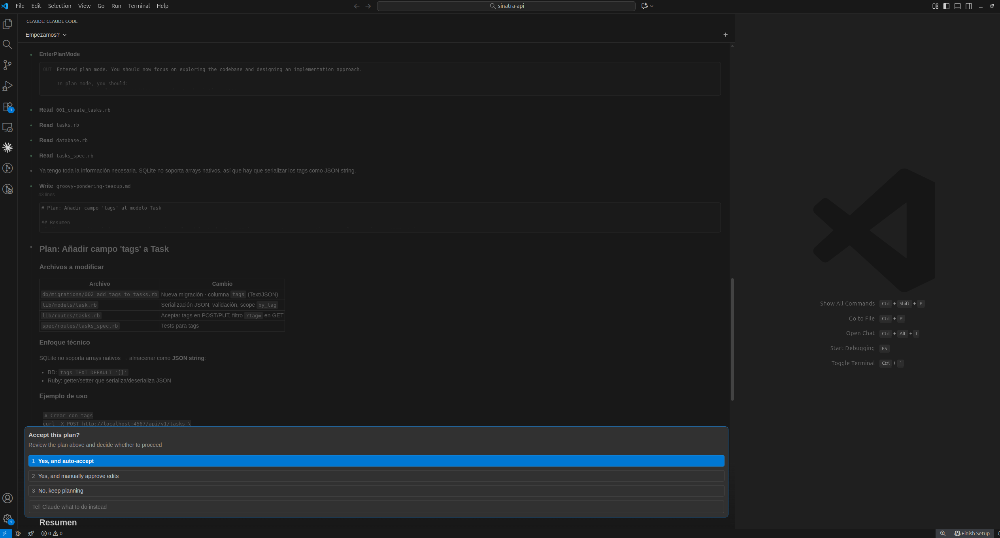
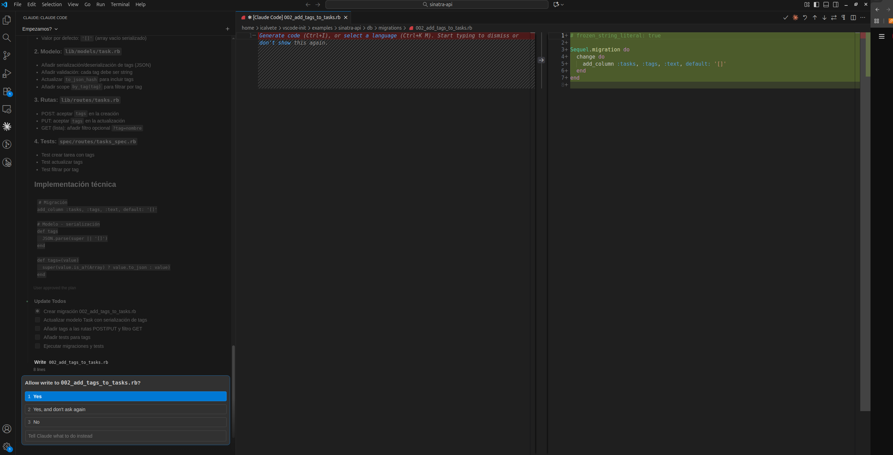
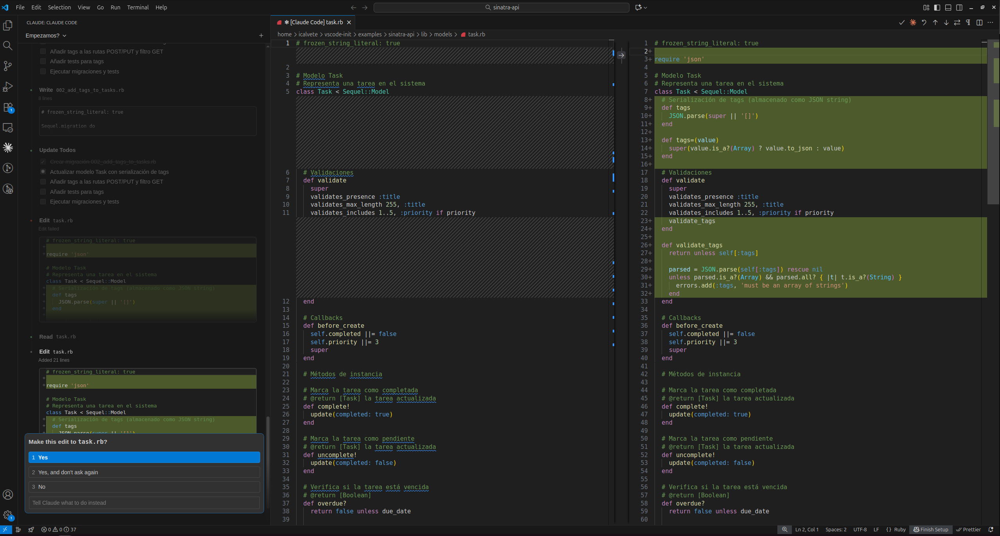
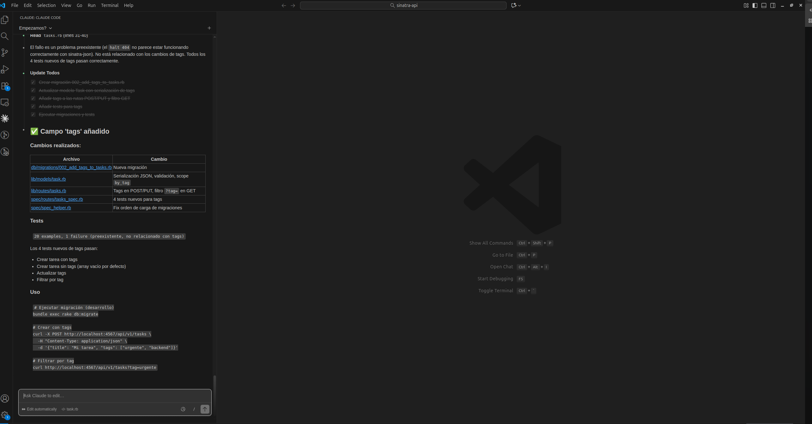

# Tutorial práctico: VS Code + Claude Code

Este tutorial te guía paso a paso para desarrollar una API con **Visual Studio Code** y la extensión **Claude Code**.

## Antes de empezar

### Verificar instalación

```bash
# Verificar que todo está instalado
vscode-config claude-code status
```

Deberías ver:
```
✓ Claude Code CLI instalado
✓ Autenticado
✓ anthropic.claude-code instalada
✓ Node.js: v20.x.x
✓ VS Code: 1.9x.x
```

Si falta algo:
```bash
# Instalar CLI
curl -fsSL https://claude.ai/install.sh | bash

# Configurar VS Code
vscode-config claude-code setup

# Autenticarse
claude login
```

---

## Paso 1: Abrir el proyecto en VS Code

```bash
cd examples/sinatra-api
code .
```

### Abrir el panel de Claude Code

1. Abre la paleta de comandos: `Ctrl+Shift+P`
2. Escribe: `Claude Code: Open`
3. Pulsa Enter



### Primera vista del panel

Al abrirse, verás el panel listo para empezar:



### Primera interacción

Escribe tu primera pregunta (por ejemplo "Empezamos?") y Claude leerá automáticamente `CLAUDE.md` para entender el contexto del proyecto:



---

## Paso 2: Explorar el proyecto con Claude

### Pedir un resumen

Escribe en el panel:

```
¿Qué archivos tenemos y qué hace cada uno?
```

Claude analizará la estructura y te dará un resumen:



### Ver un archivo específico

Usa `@` para referenciar archivos:

```
@lib/models/task.rb explícame las validaciones
```

Claude te explicará el código en detalle:


---

## Paso 3: Hacer tu primer cambio

### Pedir una modificación

Escribe:

```
Añade un campo 'tags' al modelo Task. Debe ser un array de strings.
```

### Modo Plan

Para cambios significativos, Claude te preguntará si quieres entrar en modo Plan:



- **Yes**: Claude planifica los cambios antes de ejecutarlos
- **No**: Claude ejecuta directamente
- **Tell Claude what to do instead**: Da instrucciones diferentes

> **Nota**: Claude hace preguntas interactivas durante el flujo. Responde según lo que necesites.

### Revisar el plan

Responde **Yes** y Claude te mostrará el plan detallado:



El plan incluye:
- Archivos a modificar y qué cambios hará en cada uno
- Enfoque técnico (ej: cómo manejar arrays en SQLite)
- Ejemplo de uso

### Aceptar el plan

Claude pregunta **"Accept this plan?"**:

- **Yes, and auto-accept**: Ejecuta todo automáticamente
- **Yes, and manually approve edits**: Revisa cada cambio antes de aplicarlo
- **No, keep planning**: Sigue refinando el plan
- **Tell Claude what to do instead**: Cambia de dirección

### Revisar cada cambio

Con **"Yes, and manually approve edits"**, Claude te muestra cada diff y pregunta antes de guardar:



El proceso se repite para cada archivo del plan:



- **Yes**: Guarda este archivo
- **Yes, and don't ask again**: Guarda este y los siguientes sin preguntar
- **No**: Rechaza este cambio
- **Tell Claude what to do instead**: Pide modificaciones

> En este tutorial elegimos **"Yes, and don't ask again"** para que Claude aplique el resto de cambios automáticamente.

> **Nota**: Claude también puede pedir permiso para ejecutar comandos como `bundle install` o `bundle exec rspec`. Acepta para que complete el flujo.

> **Iteración automática**: Si los tests fallan, Claude corrige el código y vuelve a ejecutarlos. Este ciclo se repite hasta que todo pase. Es normal y parte del flujo.

### Resultado final

Cuando termina, Claude muestra un resumen de los cambios realizados:



---

## Paso 4: Ver diffs en detalle

### Expandir el panel

Arrastra el borde del panel de Claude Code hacia la derecha para hacerlo más ancho.

```
Ancho normal:          Ancho expandido:
┌──────┐               ┌────────────────────────┐
│ diff │               │ - línea eliminada      │
│ ...  │               │ + línea añadida        │
└──────┘               │ + otra línea añadida   │
                       └────────────────────────┘
```

Con más espacio, los diffs se muestran inline completos.

### Navegar entre cambios

Si Claude propone cambios en varios archivos:

```
Archivos modificados:
├── lib/models/task.rb         [Ver diff]
├── lib/routes/tasks.rb        [Ver diff]
└── spec/routes/tasks_spec.rb  [Ver diff]
```

Haz clic en cada uno para revisar individualmente.

---

## Paso 5: Trabajar con errores

### Compartir errores automáticamente

Si tienes errores en el código (subrayados rojos), Claude Code los detecta automáticamente cuando mencionas el archivo.

```
@lib/routes/tasks.rb hay un error en la línea 45, ¿puedes arreglarlo?
```

### Copiar errores de la terminal

Si ejecutas tests y fallan:

```bash
bundle exec rspec
```

Copia el error y pégalo en el panel:

```
Este test falla:

Failures:
  1) Tasks API POST /api/v1/tasks creates a task with tags
     Failure/Error: expect(json_response['data']['tags']).to eq(['urgent'])
     expected: ["urgent"]
          got: nil

¿Puedes arreglarlo?
```

---

## Paso 6: Flujo TDD con Claude Code

### 1. Pedir el test primero

```
Escribe un test para un nuevo endpoint GET /api/v1/tasks/overdue
que devuelva solo las tareas vencidas
```

Claude creará el test en `spec/routes/tasks_spec.rb`.

### 2. Ver que falla

```bash
bundle exec rspec spec/routes/tasks_spec.rb
```

El test fallará porque el endpoint no existe.

### 3. Pedir la implementación

```
Ahora implementa el endpoint para que el test pase
```

Claude modificará `lib/routes/tasks.rb`.

### 4. Verificar

```bash
bundle exec rspec spec/routes/tasks_spec.rb
# => 0 failures
```

---

## Paso 7: Refactoring guiado

### Pedir revisión

```
/review
```

Claude analizará el código y sugerirá mejoras.

### Pedir refactoring específico

```
El método de filtrado en @lib/routes/tasks.rb está muy largo.
¿Puedes extraerlo a un método privado?
```

### Ver el antes y después

Claude te mostrará:

```diff
- # Código inline largo
- tasks = Task.dataset
- tasks = tasks.completed if params[:completed] == 'true'
- tasks = tasks.pending if params[:completed] == 'false'
- # ... más líneas

+ tasks = apply_filters(Task.dataset, params)

+ private
+
+ def apply_filters(dataset, params)
+   # Lógica extraída aquí
+ end
```

---

## Paso 8: Commits con Claude Code

### Desde VS Code

Después de hacer cambios:

```
Crea un commit con los cambios actuales
```

Claude:
1. Ejecutará `git status` y `git diff`
2. Propondrá un mensaje de commit
3. Te pedirá confirmación

```
Cambios detectados:
- lib/models/task.rb (modificado)
- db/migrations/002_add_tags.rb (nuevo)

Mensaje propuesto:
feat: add tags field to Task model

¿Crear commit? [Sí/No]
```

---

## Paso 9: Comandos útiles

### Comandos slash

Escríbelos directamente en el panel:

| Comando | Qué hace |
|---------|----------|
| `/clear` | Limpia la conversación |
| `/review` | Revisa el código del proyecto |
| `/memory` | Abre CLAUDE.md para editarlo |
| `/cost` | Muestra tokens usados |
| `/model` | Cambia el modelo (Sonnet/Opus) |

### Atajos en el panel

| Acción | Cómo hacerlo |
|--------|--------------|
| Referenciar archivo | Escribe `@` y selecciona |
| Ver diff expandido | `Ctrl+Click` en el diff |
| Nueva línea | `Shift+Enter` |
| Cancelar | `Ctrl+C` |

---

## Paso 10: Guardar aprendizajes

### Actualizar CLAUDE.md

Cuando descubras algo importante sobre el proyecto:

```
#Nota: los tags se guardan como JSON serializado, no como array nativo
```

El `#` al inicio añade la nota a `CLAUDE.md` automáticamente.

### O manualmente

```
/memory
```

Se abrirá `CLAUDE.md` en el editor. Añade notas como:

```markdown
## Notas de desarrollo

- Los tags se serializan como JSON en SQLite
- El endpoint /overdue usa el scope `Task.overdue`
```

---

## Resumen del flujo de trabajo

```
┌─────────────────────────────────────────────────────────┐
│                                                         │
│  1. Abrir VS Code con el proyecto                       │
│         ↓                                               │
│  2. Abrir panel Claude Code (icono ✦)                   │
│         ↓                                               │
│  3. Describir qué quieres hacer                         │
│         ↓                                               │
│  4. Revisar los diffs propuestos                        │
│         ↓                                               │
│  5. Aceptar/Rechazar cambios                            │
│         ↓                                               │
│  6. Ejecutar tests para verificar                       │
│         ↓                                               │
│  7. Commit cuando esté listo                            │
│                                                         │
└─────────────────────────────────────────────────────────┘
```

---

## Errores comunes

### "Claude Code no responde"

1. Verifica conexión a internet
2. Ejecuta `claude auth status` en terminal
3. Reinicia VS Code

### "No veo los diffs"

- Expande el panel (arrástralo más ancho)
- Haz clic en "Ver más" o `Ctrl+Click`

### "Los cambios no se aplican"

- Asegúrate de hacer clic en "Aceptar"
- Verifica que el archivo no esté bloqueado
- Guarda el archivo después de aceptar (`Ctrl+S`)

---

## Siguiente paso

Abre este proyecto en VS Code y prueba:

```bash
code .
```

Luego en el panel de Claude Code:

```
Hola! Veo que ya hay código base.
¿Puedes añadir un endpoint para buscar tareas por título?
```

Y sigue el flujo: revisar diff → aceptar → probar → commit.
